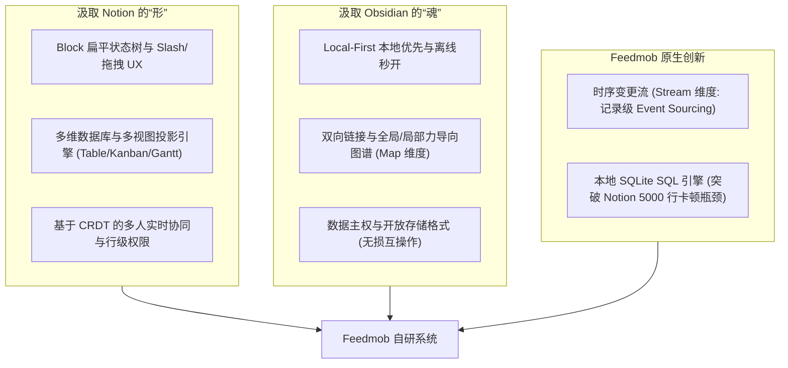

# Notion vs Obsidian 对比分析报告：架构设计哲学与工程实现权衡

> **调研视角**：系统架构师 & 资深产品专家  
> **核心目的**：横向对比两种截然不同的架构范式，为团队自研“Feedmob”提供工程权衡与选型决策依据。  
> **更新时间**：2026 年 8 月

---

## 一、架构哲学总览：两种范式的根本对立

| 维度 | Notion 范式：云端中心化关系型工作空间 | Obsidian 范式：本地优先去中心化知识图谱 |
|---|---|---|
| **底层核心范式** | **Cloud-First & Server-Authoritative**（云端事务为事实来源） | **Local-First & Client-Authoritative**（本地文件为事实来源） |
| **基础数据单元** | **Normalized Block Record**（原子块记录与 ID 指针） | **Markdown File + Frontmatter**（自包含纯文本文件） |
| **拓扑组织结构** | **树状严格嵌套（Tree Hierarchy）** + 数据库行关联 | **网状双向图谱（Network Graph）** + 扁平文件夹 |
| **多维数据实现** | 内存关系型投影引擎（多视图解耦） | 文本元数据扫描（Bases / Dataview 插件） |
| **协同与一致性** | 中心化操作日志（Operation Stream）+ 实时广播 | 本地单机读写 + 异步文件级同步（无 CRDT 实时协同） |
| **扩展机制** | 外部 API 集成 + Webhooks / MCP 协议 | 内部运行时代币注入 + CodeMirror 6 深度 Hook |
| **最大护城河** | **Block 自由排版 + 零拷贝多维数据库 + 成熟协同** | **极致本地性能 + 100% 数据主权 + 双向图谱网络** |

---

## 二、架构设计与工程选型核心权衡矩阵

| 架构维度 | Notion 方案 | Obsidian 方案 | 优劣评估与架构启示 |
|---|---|---|---|
| **数据存储与持久化** | 云端 PostgreSQL + 扁平 Block 映射表 | 本地文件系统 + YAML 元数据 | **Obsidian 在数据主权与零锁定上完胜**；Notion 虽便于多端一致，但带来严重厂商锁定与数据合规隐患。 |
| **实时协同与并发控制** | 服务端事务排序 + 块级 LWW + 字符级协同 | 无实时同屏协同，依赖文件差异比对 | **Notion 在协同生产力上具备代际优势**；Obsidian 无法支撑 5 人以上团队的高频协同。 |
| **结构化关系计算** | 内存级 Relation 外键与 Rollup DAG 聚合 | 正则/AST 遍历 Markdown 文本进行索引 | **Notion 的关系数据库能力碾压**；但由于全量加载至前端计算，存在单表 5,000 行卡顿的工程瓶颈。 |
| **知识关联与可视化** | 仅支持单向父子嵌套，缺乏双向图谱 | 原生支持 Wikilink 双向链接与力导向图谱 | **Obsidian 在网状思维与空间可视化上完胜**；Notion 的纯树状结构难以展现交叉关联的知识网络。 |
| **离线与弱网弹性** | 伪离线（受限单页缓存，数据库仅 50 行） | 默认 100% 离线运行，无网络等待 | **Obsidian 在单机性能与离线可用性上完胜**；Notion 的离线体验是其公认的最差体验之一。 |
| **数据导出与互操作** | 有损导出（退化为打平 CSV + 断裂链接） | 无需导出，原生即标准 Markdown 文件 | **Notion 迁移代价极高**；自研系统必须在保持 Block 结构的同时提供无损导入导出能力。 |

---

## 三、关键能力深度拆解与技术对比

```mermaid
quadrantChart
    title 架构选型象限图：协作能力 vs 数据主权与本地性能
    x-axis 弱数据主权/云依赖 --> 强数据主权/本地优先
    y-axis 弱实时协同/单机 --> 强团队实时协同
    quadrant-1 理想的自研目标 (Feedmob)
    quadrant-2 Notion (协同强但云锁定/离线差)
    quadrant-3 传统单机文档
    quadrant-4 Obsidian (数据主权强但缺乏协同)
    "Notion": [0.15, 0.85]
    "Obsidian": [0.85, 0.2]
    "Feedmob (自研目标)": [0.8, 0.85]
```

### 3.1 协同与并发控制：中心化流水线 vs 异步文件合并
* **Notion 的优势**：将文档变更解构成微粒度的 Block 操作（`set_block`、`update_content`），多人同屏共写、光标跟随、内联评论非常丝滑。
* **Obsidian 的硬伤**：由于以“整个文件”为存储单元，无法进行细粒度的并发操作合并。多人同时编辑极易触发合并冲突，产生孤儿副本文件。

### 3.2 结构化数据：轻量关系型投影 vs 文本元数据扫描
* **Notion 的优势**：Schema 是一等公民。用户可以在 Table、Kanban、Timeline 之间一秒无损切换，且跨表汇总（Rollup）自动更新，真正具备了轻量 ERP / 项目看板的能力。
* **Obsidian 的妥协**：其 Bases 或 Dataview 插件本质是“全库扫描 Markdown 文件头部的 YAML 属性”。在处理大量数据或复杂跨文件外键时，计算效率低且缺乏强一致性约束。

### 3.3 拓扑结构：严格父子树 vs 自由双向网
* **Notion 的局限**：强层级（Hierarchical）文档树。一个页面只能从属于一个父页面，当知识存在跨部门、跨维度的交叉从属时，只能依靠“关联数据库”进行打补丁式关联。
* **Obsidian 的自由**：图状拓扑（Graph Topology）。任意节点可通过 `[[双链]]` 建立连接，知识网状自底向上涌现，完美契合技术研发与系统架构的网状关联特征。

---

## 四、团队自研“Feedmob”的融合路线图

Notion 与 Obsidian 的优缺点呈现出**高度互补**的特征。自研“Feedmob”的核心战略不是“二选一”，而是**在底层架构上实现两者的基因重组**：



### 总结公式
$$\text{Feedmob} = \text{Notion (Block + 结构化多视图 + 实时协同)} + \text{Obsidian (本地优先 + 双向图谱 + 数据主权)} + \text{原生创新 (时序流 + 本地 SQL 引擎)}$$
