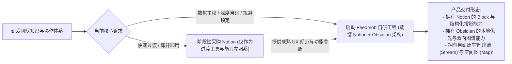
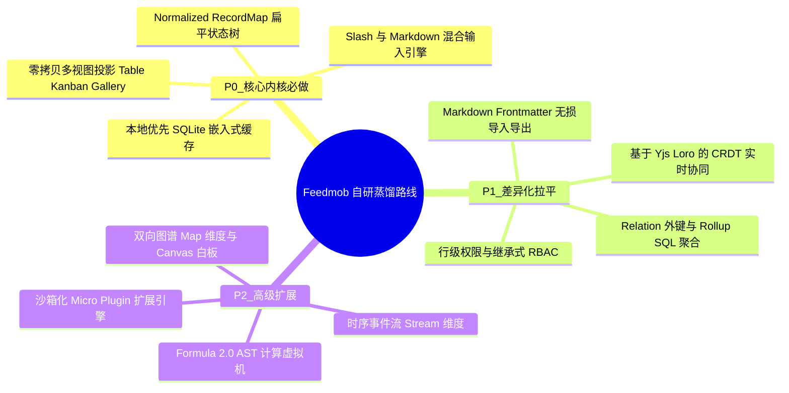
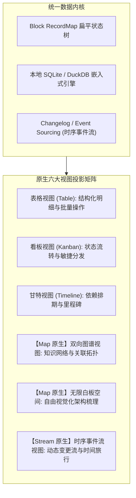
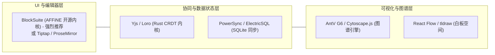
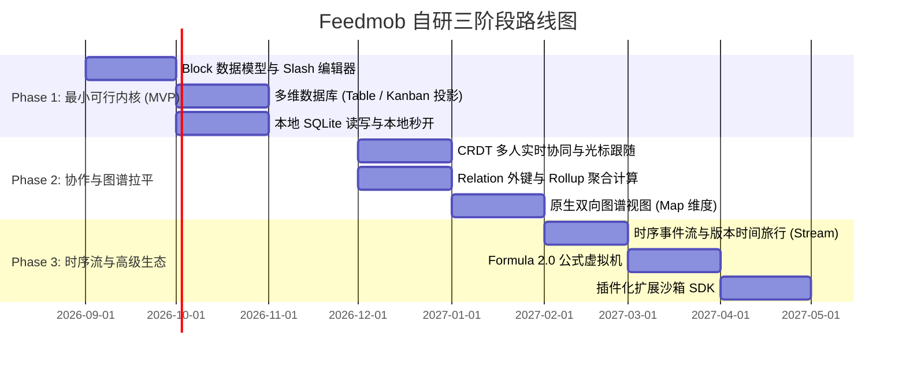

# 核心结论与蒸馏建议：Feedmob 自研架构蓝图与决策支撑

> **面向对象**：团队研发负责人、架构委员会、产品决策层  
> **核心使命**：提供 Notion 核心能力的“蒸馏提取清单”、底层架构规格书、技术选型矩阵与避坑实施路线。  
> **更新时间**：2026 年 8 月

---

## 一、战略决策结论（Build vs Buy）

### 1. 外部工具定位明确
* **Notion：仅作为“过渡期协作工具”与“产品交互参照系”，严禁作为核心业务的长期战略底座**。其云端数据锁定、闭源格式、伪离线缺陷以及随规模非线性膨胀的 TCO（按人头及 AI 计费）会成为团队扩展的严重制约。
* **Obsidian：仅作为“设计哲学来源”与“研发个人工具”，不作为团队主工具**。吸收其本地优先、纯文本开放格式与双向图谱设计，抛弃其缺乏多人实时协同的文件级同步架构。

---

## 二、Notion 核心资产蒸馏清单（Distillation Specification）

按工程实现复杂度与产品核心价值，严格划定自研三级优先级：

### 详细技术指标与规格定义

| 优先级 | 模块名称 | 蒸馏核心逻辑与工程规格 | 自研技术实现要点 |
|---|---|---|---|
| **P0** | **Block 扁平状态树 (RecordMap)** | 彻底打破文档与表格物理边界。文档抽象为 `Map<UUID, BlockRecord>`，子节点通过 ID 一维有序数组索引。 | 避免深层递归 JSON 序列化；局部移动只需修改父子指针，大幅降低重绘与协同开销。 |
| **P0** | **Slash 交互与键盘流** | `/` 唤起浮动组件选择器；Markdown 原生符号（`# `, `- [ ]`, `>`, `---`）零延迟无缝转换为对应 Block。 | 监听 `inputRule` 与光标事件，确保输入心流连贯不被工具栏打断。 |
| **P0** | **零拷贝多视图投影引擎** | 数据层（Collection Rows）与表现层（Views）彻底分离。统一底层数据，通过 Query AST 动态输出 Table / Kanban / Gallery 视图。 | 视图切换仅改变前端渲染容器与 Filter/Sort 规则，零数据冗余复制。 |
| **P1** | **Relation & Rollup 聚合引擎** | 实现轻量级关系模型。Relation 记录关联 UUID 列表；Rollup 执行求和、均值、百分比等聚合函数。 | **超越 Notion 关键**：放弃前端内存 JS 计算，改用**底层嵌入式 SQL（SQLite/DuckDB）执行 Join/Group By**，突破单表性能瓶颈。 |
| **P1** | **CRDT 实时协同与离线同步** | 多人同屏毫秒级光标与文本协同；离线状态下本地无感编辑，联网后自动增量合并。 | 放弃复杂的中心化 OT 流水线，采用成熟的 **Yjs** 或 Rust 编写的高性能 **Loro CRDT**。 |
| **P1** | **无损数据互操作协议** | 解决 Notion 的有损导出痛点。支持在 Block 状态树与标准 `Markdown + YAML Frontmatter` 间双向无损互转。 | 编写 AST 双向编译器，自定义扩展语法块（如 Callout、Database）。 |
| **P2** | **Formula 2.0 虚拟机** | 支持强类型运算、条件分支、闭包与集合操作的表达式解析引擎。 | 构建轻量级 AST 解析器与类型推导运行沙箱，支持惰性求值。 |
| **P2** | **沙箱化插件引擎** | 开放视图注册、Markdown 渲染拦截与编辑器扩展点。 | 采用 Web Worker / iframe 沙箱隔离，规避 Obsidian 插件直接访问系统的安全隐患。 |

---

## 三、“Feedmob”原生创新与差异化架构蓝图

自研系统的核心壁垒在于将 Notion 的“静态结构化块”与 Obsidian 的“图谱网络”融合，并进一步引入**“时序流（Stream）”**：

### 1. 核心维度升级说明
1. **时序流维度（Stream Dimension）**：
   * Notion 的数据库是静态的状态快照。Feedmob 将 **Event Sourcing（事件溯源）** 内建为一等公民。
   * 每条记录天然携带时序变更流（Changelog Stream），支持“时间旅行（Time Travel）”查看历史任意时刻的状态，且变更事件可直接作为 Webhook 触发自动化任务。
2. **空间图谱维度（Map Dimension）**：
   * 在多维数据库中，原生新增**“双向拓扑图谱视图（Graph View）”**与**“无限白板视图（Canvas View）”**。
   * 自动将 Relation 关系以及正文内的 `[[双链]]` 渲染为动态交互图谱，补齐 Notion 无法可视化知识网络的致命缺陷。
3. **架构底层：Local-First 嵌入式 SQL**：
   * 所有数据先写入本地 SQLite，查询直接在客户端利用 SQL 索引秒级完成（毫秒级响应万级数据）；云端仅负责增量 Log 广播与备份。

---

## 四、针对 Notion 四大架构硬伤的避坑与超越方案

| Notion 架构缺陷 | 缺陷底层根因 | Feedmob 自研规避与超越方案 |
|---|---|---|
| **大库卡顿白屏 (5,000+ 行崩溃)** | 前端全量拉取 JSON，在 React 运行时中做内存 JS Filter/Sort/Rollup。 | **本地 SQLite 索引 + 虚拟滚动**：将过滤与 Rollup 聚合下推至 SQLite 引擎执行，前端仅渲染视口内的 20~30 个 DOM，轻松支持 10 万+ 记录。 |
| **伪离线与弱网丢数据** | 中心化云端架构，客户端仅做弱缓存；重连后版本重放易发生冲突覆盖。 | **纯 Local-First + CRDT（Yjs/Loro）**：单机默认 100% 离线可用；联网后基于数学确定性的 CRDT 算法进行增量状态合并，零覆盖风险。 |
| **权限穿透导致 Rollup 报错** | 权限由服务端按表粗暴隔离，前端缺乏脱敏聚合抽象。 | **计算层“脱敏聚合”代理**：无子表权限时，计算引擎允许返回非敏感统计量（如子任务数、求和），但隐藏明细行，避免破坏全局大盘。 |
| **有损导出与厂商锁定** | 专有 Block 协议，导出时粗暴打平为无关联的 CSV + 带 UUID 的 MD。 | **双向无损 AST 转换器**：原生支持将 Block 树编译为扩展 Markdown（保留 YAML 属性与嵌套标记），一键导出为纯文本标准库。 |

---

## 五、推荐开源技术栈与选型矩阵（What to Build vs Reuse）

避免从零造轮子，建议采用经过千万级用户验证的成熟开源底座组合进行蒸馏：

### 具体选型建议清单
1. **编辑器与 Block 状态底座（强烈建议复用）**：
   * **推荐选型**：**BlockSuite**（AFFiNE 团队开源的块级编辑器底座，原生支持 Block 树、多视图数据表和协作）或 **Tiptap / ProseMirror**。
   * *理由*：直接获得成熟的 Slash 交互、Block 拖拽和选区管理能力，节省至少 6~9 个月底层编辑器研发时间。
2. **协同引擎与状态同步**：
   * **推荐选型**：**Yjs**（生态最繁荣的 Web 端 CRDT）或 **Loro**（Rust 开发的高性能 CRDT，支持富文本、列表与时间旅行）。
3. **本地数据库与同步中间件**：
   * **推荐选型**：**PowerSync** 或 **ElectricSQL**，配合前端 **SQLite-WASM（OPFS 驱动）**。
4. **图谱与白板可视化**：
   * **推荐选型**：**AntV G6 / Cytoscape.js**（图谱拓扑力导向布局）+ **React Flow**（看板/流向排版）。

---

## 六、自研实施路线规划（三阶段演进）

### 交付目标总结
* **Phase 1（2~3个月）**：跑通“单机版 Block 编辑器 + 零拷贝多维表格”，单机性能秒杀 Notion，具备可用性。
* **Phase 2（2~3个月）**：引入 Yjs 实时协同与双向图谱（Map），全面替代第三方 SaaS 工具。
* **Phase 3（2~3个月）**：上线时序流（Stream）、公式计算与插件生态，完成对团队核心业务流的全面赋能。
